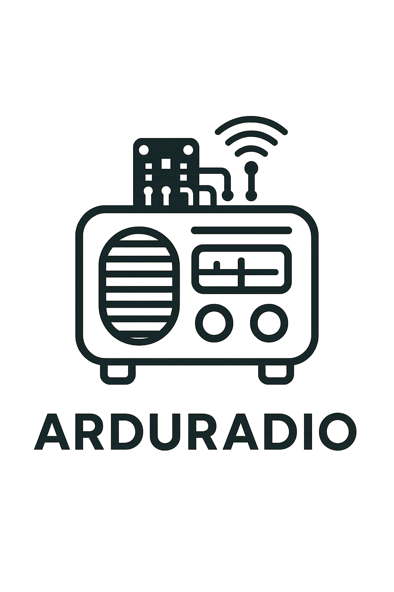

<!-- PROJECT LOGO -->
 

  

  

    Add a whole new life to a 1970 Mangalia 2 radio with a Raspberry Pi 5.
     
     
     
  

## Author

👤 **Daniel Dumitrascu**

- Linkedin: [@DanielDumitrascu](https://www.linkedin.com/in/daniel-dumitrascu-17a1845a)
- Github: [@daniel-dumitrascu](https://github.com/daniel-dumitrascu)
- Email: daniel.dumitrascu.dev@gmail.com

## License

Distributed under the MIT License. 
